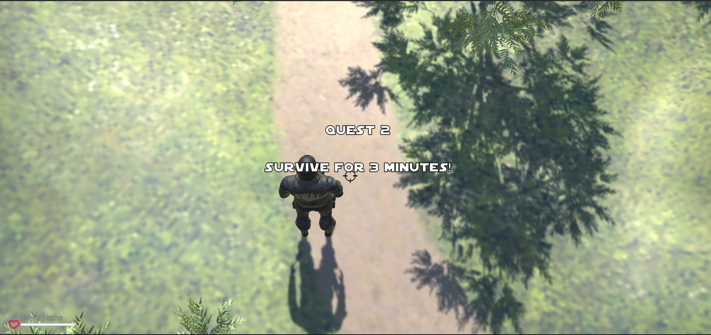

# IF3210 2024 Unity AJG

# Tubes 2 IF3210 Pengembangan Aplikasi pada Platform

> Extended Survival Shooter written in the concept of Unity platform-based programming.

## Table of Contents

- [Tubes 2 IF3210 Pengembangan Aplikasi pada Platform](#tubes-2-if3210-pengembangan-aplikasi-pada-platform)
  - [Table of Contents](#table-of-contents)
  - [Introduction](#introduction)
  - [General Information](#general-information)
    - [Background](#background)
    - [Objective](#objective)
    - [Description](#description)
  - [Libraries Used](#libraries-used)
  - [Screenshots](#screenshots)
  - [Job Description](#job-description)

## Introduction
This project was created by:
| No. | Name | Student ID |
| :---: | :---: | :---: |
| 1. | Alexander Jason | 13521100 |
| 2. | Farhan Nabil Suryono | 13521114 |
| 3. | Juan Christopher Santoso | 13521116 |
| 4. | Nathania Calista | 13521139 |
| 5. | Antonio Natthan Krishna | 13521162 |

## General Information
### Background
Zombie Puppet is invading the universe. As the cosmic police office, Lex Starwalker, has duties to kill them all and save all planet. He journeyed through Kashyyyk and finally reached the Coruscant (Extinct Star). There, he faced the final boss, Hellephant. Help Lex to save the universe!

### Objective
1. Understand the basic principles of programming in Unity
2. Able to work in groups on Unity application development
3. Able to present the software that has been built

### Description
Extended Survival Shooter is a modification of the Survival Shooter game that has additional functionality, including the following:

1. Story Mode
2. Save & Load Game
3. Game Over
4. Game Statistic
5. Main Menu
6. Shopkeeper
7. Weapon
8. Pet
9. Cheat
10. Mobs
11. Orb Power Up

## Libraries Used

- Unity
- UnityEngine
- System
- TMPro

## Screenshots

### Story Mode

#### Cutscene

#### Quest

### Save & Load game

### Game Over

### Game Statistic

### Main Menu

### Shopkeeper

### Weapon

### Pet

### Orb Power Up

## Job Description
<table>
  <tr>
    <th>NIM</th>
    <th>Nama</th>
    <th>Tugas</th>
    <th>Jam Persiapan dan Pengerjaan</th>
  </tr>
  <tr>
    <td>13521100</td>
    <td>Alexander Jason</td>
    <td>
      - Quest 4 
      - Weapon 
      - Boss HealthBar 
      - Pet 
      - Mobs 
      - Cheat
    </td>
    <td>80 jam</td>
  </tr>
  <tr>
    <td>13521114</td>
    <td>Farhan Nabil Suryono</td>
    <td>
      - Main Menu 
      - Save & Load Game  
      - Game Statistic 
      - Shopkeeper 
      - Cheat
    </td>
    <td>80 jam</td>
  </tr>
  <tr>
    <td>13521116</td>
    <td>Juan Christopher Santoso</td>
    <td>
      - Quest 2 
      - Shopkeeper 
      - Scene Transition 
      - Pet 
      - Save & Shop Scene (Isolated Scene) 
      - Loading Screen  
      - Cheat
    </td>
    <td>80 jam</td>
  </tr>
  <tr>
    <td>13521139</td>
    <td>Nathania Calista</td>
    <td>
      - Quest 3 
      - Mobs 
      - Orb Power Up 
      - Player Healthbar  
      - Game Over Animation 
      - Scene Transition
    </td>
    <td>80 jam</td>
  </tr>
  <tr>
    <td>13521162</td>
    <td>Antonio Natthan Krishna</td>
    <td>
        - Quest 1 
        - Main Player 
        - Weapon 
        - Cutscene Opening, Ending, Transition 
        - Cheat
    </td>
    <td>80 jam</td>
  </tr>
</table>
